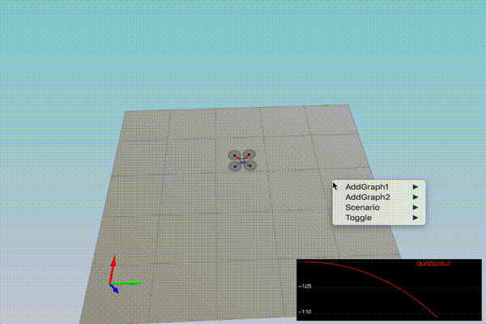

## Project: 3D Control

---

# Required Steps for a Passing Submission:
1. Python  
- Completion of the five control function.  
- Controller's performance on its ability to follow a trajectory. Drone will need to meet these minimum performance metrics on the test trajectory provided:
  - The drone flies the test trajectory faster than the default threshold (20 seconds)
  - The maximum horizontal error is less than the default threshold (2 meters)
  - The maximum vertical error is less than the default threshold (1 meter)
2. C++  
- Completion of the five control functions, the motor command functions, and controller's performance in each scenario.  
- Controller will need to meet minimum performance metrics provided for each scenario.
---


### 1. Python
The five control function were completed. See controller.py file.

See video below for demo
<p align="center">

</p>
Result:

```
Maximum Horizontal Error:  1.8288032077264642
Maximum Vertical Error:  0.8099416341524801
Mission Time:  1.817406
Mission Success:  True
```

### 2. C++
The five control functions were completed. See QuadController.cpp and QuadControlParams.txt files  

Controller meets performance metrics for following scenarii:  
- Intro  
- AttitudeControl  
- PositionControl  
- Nonidealities  

Below the video for all scenarii:
<p align="center">

</p>  


Thank you for your attention !